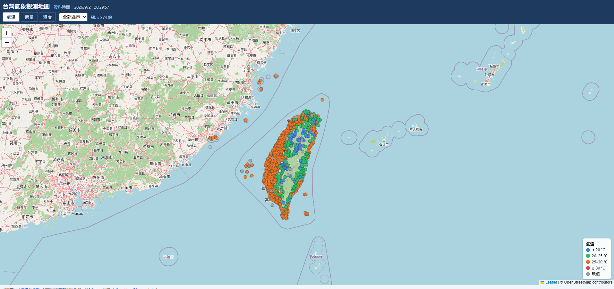

# 台灣氣象觀測 GIS 地圖（CWA Weather GIS）

**🌐 線上網址：<https://cwa-weather-gis.vercel.app/>**

從中央氣象署開放資料平台抓取自動氣象站觀測（`O-A0001-001`），存入 SQLite，
匯出 GeoJSON，並以 Leaflet 畫在台灣地圖上。經 GitHub Actions 每 3 小時自動更新資料，
push 後由 Vercel 自動部署。

完整設計文件見 [design.md](design.md)。



## 架構

```
CWA API → scripts/fetch_cwa.py → data/weather.db (SQLite)
        → public/data/latest.json (GeoJSON) → git push → Vercel → 瀏覽器 (Leaflet)
```

瀏覽器只讀靜態的 `latest.json`，不會接觸 CWA API 或授權碼。

## 本機執行

1. 到 <https://opendata.cwa.gov.tw/> 註冊並取得授權碼。
2. 設定環境變數並執行：

```powershell
$env:CWA_API_KEY = "你的授權碼"     # Windows PowerShell
pip install -r requirements.txt
python scripts/fetch_cwa.py
python -m http.server 8000 --directory public
```

打開 <http://localhost:8000> 即可看到地圖。

## 部署

- **GitHub Actions**：於 repo Settings → Secrets and variables → Actions 新增
  `CWA_API_KEY`，排程（每 3 小時）會自動抓資料並 commit。
- **Vercel**：匯入本 repo，Framework Preset 選 **Other**，Build Command 留空，
  Output Directory 設為 `public`。

## 資料來源與授權

- 資料來源：[中央氣象署](https://opendata.cwa.gov.tw/)（政府資料開放授權條款－第1版）
- 底圖：© [OpenStreetMap](https://www.openstreetmap.org/copyright) contributors
