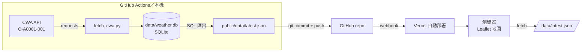

# design.md｜CWA 氣象觀測 GIS 地圖（AIoT DIC-2）

| 項目 | 內容 |
|---|---|
| 作者 | Leo Kuo（郭乃瑋） |
| 狀態 | Draft v0.2（2026-09-21）— 已取得 CWA 授權碼，待本機測試 API |
| 一句話 | 從中央氣象署開放資料抓測站觀測，存進資料庫，畫在台灣地圖上，經 GitHub 自動部署到 Vercel |

---

## 1. 目標與範圍

### 1.1 目標（對應五個步驟）

| # | 你的步驟 | 本設計的具體定義 |
|---|---|---|
| 1 | CWA related API | 使用 `O-A0001-001` 自動氣象站觀測資料（JSON，含測站經緯度） |
| 2 | 抓政府資料並存進 database | Python 腳本 → SQLite（`data/weather.db`）→ 匯出 `latest.json` |
| 3 | 本機做 GIS 網頁，把資料放到地圖上的位置 | 靜態網頁 + Leaflet；每個測站一個圓點，顏色代表氣溫 |
| 4 | push to GitHub | 公開 repo；程式與資料一起版本控制，資料同時作為 open data |
| 5 | auto deploy to Vercel | Vercel 連結 repo，每次 push 自動部署；GitHub Actions 排程更新資料 |

### 1.2 不做的事（Non-goals）

- 不在 Vercel 上執行資料庫或 Python 後端（第一版）。
- 不做使用者登入、不收集任何個人資料。
- 不做天氣「預報」；第一版只有「觀測」。縣市預報面量圖列為第二階段（§10）。

### 1.3 成功標準

- 打開 Vercel 網址 3 秒內看到台灣地圖與全部測站點位。
- 點任一測站可看到站名、縣市鄉鎮、觀測時間、氣溫、濕度、雨量、風速。
- 不需人工操作，網站資料最多落後 3 小時。
- repo 內找不到 API 授權碼。

---

## 2. 關鍵設計決策

| # | 決策 | 選擇 | 理由 | 放棄的方案 |
|---|---|---|---|---|
| D1 | 資料庫放哪 | SQLite 檔案，在本機與 GitHub Actions 中讀寫；網站只讀匯出的 JSON | Vercel 檔案系統是暫時性的，執行期寫入會消失；這個做法零成本、零帳號 | 雲端 DB（Supabase／Neon／Turso）：更像正式系統，但多一組金鑰與一層 API，留到 §10 |
| D2 | 前端技術 | 純 HTML + JS + Leaflet，無建置步驟 | 本機與 Vercel 行為完全一致；Streamlit／Folium 無法部署到 Vercel | Next.js：功能強，但對這個規模是負擔 |
| D3 | 資料集 | `O-A0001-001`（點資料） | 資料本身帶座標，最直接對應「put data on the location on map」 | `F-C0032-005` 縣市預報需另備縣市界圖資並做屬性連結；`F-A0010-001` 疑似已下架 |
| D4 | 資料更新 | GitHub Actions cron，每 3 小時 | Vercel 的 auto deploy 只會更新程式，不會自己去抓資料 | Vercel Cron + serverless：仍需要外部 DB 才能保存 |
| D5 | 座標 | 只取 `CoordinateName == "WGS84"` 那一組 | API 同時回傳 TWD67 與 WGS84，兩者相差數百公尺；Leaflet 使用 WGS84 | 用 `Coordinates[0]`：網路上常見寫法，但第一組是 TWD67，點位會偏移 |

---

## 3. 系統架構



**資料流**：CWA → Python → SQLite → JSON → Git → Vercel CDN → 瀏覽器。
瀏覽器從頭到尾不會碰到 CWA API，也不會碰到授權碼。

---

## 4. 資料來源

### 4.1 API

```text
GET https://opendata.cwa.gov.tw/api/v1/rest/datastore/O-A0001-001?Authorization={CWA_API_KEY}
```

- 授權碼：<https://opendata.cwa.gov.tw/> 註冊後於會員頁取得。
- 授權：政府資料開放授權條款－第1版，需標示「資料來源：中央氣象署」。

### 4.2 回傳結構（只列會用到的欄位）

```text
records.Station[]
├── StationId                      "C0TB40"
├── StationName                    "崇德"
├── ObsTime.DateTime               "2026-01-05T23:00:00+08:00"
├── GeoInfo
│   ├── Coordinates[]              兩組：TWD67、WGS84
│   │   ├── CoordinateName
│   │   ├── StationLatitude
│   │   └── StationLongitude
│   ├── StationAltitude
│   ├── CountyName / TownName
│   └── CountyCode / TownCode
└── WeatherElement
    ├── Weather                    "陰"
    ├── Now.Precipitation          mm
    ├── AirTemperature             °C
    ├── RelativeHumidity           %
    ├── WindSpeed / WindDirection  m/s、度
    └── AirPressure                hPa
```

### 4.3 資料清理規則

| 情況 | 處理 |
|---|---|
| 數值為 `-99`、`-99.0` 或 `"-99"` 等（CWA 的缺值代碼，實作時以官方欄位說明文件為準） | 存成 `NULL`；地圖上該測站顯示灰色 |
| 數值是字串（例如 `StationAltitude`） | 轉 `float`，失敗則 `NULL` |
| 找不到 WGS84 座標 | 略過該測站並記錄警告 |
| 座標超出台灣範圍（緯度 21–27、經度 118–123 之外） | 略過並記錄警告 |

---

## 5. 資料庫設計（SQLite）

```sql
CREATE TABLE IF NOT EXISTS stations (
    station_id   TEXT PRIMARY KEY,
    name         TEXT NOT NULL,
    lat          REAL NOT NULL,          -- WGS84
    lon          REAL NOT NULL,          -- WGS84
    altitude     REAL,
    county       TEXT,
    town         TEXT,
    updated_at   TEXT NOT NULL
);

CREATE TABLE IF NOT EXISTS observations (
    id           INTEGER PRIMARY KEY AUTOINCREMENT,
    station_id   TEXT NOT NULL REFERENCES stations(station_id),
    obs_time     TEXT NOT NULL,          -- ISO 8601 含 +08:00
    weather      TEXT,
    temp_c       REAL,
    humidity_pct REAL,
    rain_mm      REAL,
    wind_ms      REAL,
    wind_dir     REAL,
    pressure_hpa REAL,
    fetched_at   TEXT NOT NULL,
    UNIQUE (station_id, obs_time)
);

CREATE INDEX IF NOT EXISTS idx_obs_time ON observations (obs_time);
```

**設計說明**

- **兩張表**：測站的位置資訊幾乎不變，觀測值一直新增；拆開才不會每筆觀測都重複存一次座標（正規化）。
- **`UNIQUE (station_id, obs_time)`** + `INSERT ... ON CONFLICT DO NOTHING`：腳本重跑不會產生重複資料。
- **`stations` 用 upsert**：測站搬遷或改名時自動更新。
- **保留期限**：每次執行後刪除 7 天前的觀測，控制檔案大小。

```sql
DELETE FROM observations WHERE obs_time < datetime('now', '-7 days');
```

**驗證用查詢**

```sql
SELECT COUNT(*) FROM stations;                                   -- 測站數
SELECT MAX(obs_time) FROM observations;                          -- 最新觀測時間
SELECT s.name, s.county, o.temp_c                                -- 目前最熱的 5 站
FROM observations o JOIN stations s USING (station_id)
WHERE o.obs_time = (SELECT MAX(obs_time) FROM observations WHERE station_id = o.station_id)
ORDER BY o.temp_c DESC LIMIT 5;
```

---

## 6. 前後端介面：`latest.json`

這是 Python 與前端之間唯一的約定；格式採 **GeoJSON**，任何 GIS 軟體（QGIS、ArcGIS Online）都能直接開。

```json
{
  "type": "FeatureCollection",
  "metadata": {
    "source": "中央氣象署 O-A0001-001",
    "license": "政府資料開放授權條款－第1版",
    "generatedAt": "2026-09-21T15:20:04+08:00",
    "stationCount": 0
  },
  "features": [
    {
      "type": "Feature",
      "geometry": { "type": "Point", "coordinates": [121.657414, 24.166144] },
      "properties": {
        "id": "C0TB40", "name": "崇德", "county": "花蓮縣", "town": "秀林鄉",
        "altitude": 8.0, "obsTime": "2026-01-05T23:00:00+08:00",
        "weather": "陰", "temp": 18.8, "humidity": 85, "rain": 0.0, "wind": 3.8
      }
    }
  ]
}
```

> GeoJSON 的座標順序是 **[經度, 緯度]**，和 Leaflet 的 `[lat, lon]` 相反；用 `L.geoJSON()` 讀取會自動處理，不要手動對調。

---

## 7. 元件設計

### 7.1 `scripts/fetch_cwa.py`

| 函式 | 職責 |
|---|---|
| `fetch()` | 呼叫 API，`raise_for_status()`，回傳 `records.Station` |
| `wgs84(station)` | 從 `Coordinates[]` 挑出 `CoordinateName == "WGS84"` 的那組 |
| `clean(value)` | 缺值代碼與非數字 → `None` |
| `save(conn, stations)` | upsert `stations`、insert `observations`、刪除過期資料 |
| `export(conn)` | 用 SQL 取每站最新一筆，輸出 GeoJSON |
| `main()` | 串接以上步驟；任何一步失敗就回傳非 0，且**不覆蓋**舊的 `latest.json` |

核心片段：

```python
def wgs84(station: dict) -> tuple[float, float] | None:
    for c in station["GeoInfo"]["Coordinates"]:
        if c["CoordinateName"] == "WGS84":
            return float(c["StationLatitude"]), float(c["StationLongitude"])
    return None
```

依賴：`requests`（其餘皆標準函式庫）。授權碼只從環境變數 `CWA_API_KEY` 讀取。

### 7.2 前端（`public/`）

| 檔案 | 內容 |
|---|---|
| `index.html` | 版面：標題列、變數切換（氣溫／雨量／濕度）、地圖、資訊面板 |
| `app.js` | 載入 `data/latest.json` → `L.geoJSON` + `pointToLayer` 畫 `circleMarker` → tooltip／popup → 圖例 |
| `style.css` | 版面與響應式 |

**地圖規格**

- 底圖：OpenStreetMap 圖磚（需標示 © OpenStreetMap contributors）。
- 初始視角：中心 `[23.7, 121.0]`、zoom 7；離島在 zoom 7 仍可見。
- 氣溫色階：`< 20` 藍、`20–25` 綠、`25–30` 橘、`≥ 30` 紅、缺值灰；圖例同時標示文字，不只靠顏色。
- 測站有數百個：使用 `L.canvas()` renderer，避免 SVG 元素過多造成卡頓。
- 互動：滑過顯示站名與數值；點擊顯示完整資訊；上方可依縣市篩選。
- 頁首顯示 `metadata.generatedAt`，資料超過 6 小時未更新時顯示提示。

本機預覽：

```bash
python -m http.server 8000 --directory public
```

---

## 8. Repo 結構

```text
cwa-weather-gis/
├── .github/workflows/fetch.yml
├── scripts/fetch_cwa.py
├── data/weather.db
├── public/
│   ├── index.html
│   ├── app.js
│   ├── style.css
│   └── data/latest.json
├── design.md
├── README.md
├── requirements.txt          # requests
├── vercel.json
└── .gitignore                # .venv/ .env __pycache__/ .vercel/
```

---

## 9. 部署與自動化

### 9.1 GitHub Actions（資料更新）

```yaml
name: fetch-cwa
on:
  schedule:
    - cron: "20 */3 * * *"        # UTC，每 3 小時
  workflow_dispatch:
permissions:
  contents: write
jobs:
  fetch:
    runs-on: ubuntu-latest
    steps:
      - uses: actions/checkout@v4
      - uses: actions/setup-python@v5
        with: { python-version: "3.12" }
      - run: pip install -r requirements.txt
      - run: python scripts/fetch_cwa.py
        env:
          CWA_API_KEY: ${{ secrets.CWA_API_KEY }}
      - run: |
          git config user.name "github-actions[bot]"
          git config user.email "41898282+github-actions[bot]@users.noreply.github.com"
          git add data public/data
          git diff --cached --quiet || (git commit -m "data: $(date -u +%FT%RZ)" && git push)
```

### 9.2 Vercel（網站部署）

1. Vercel → Add New Project → 匯入 repo。
2. Framework Preset：**Other**；Build Command：留空；Output Directory：`public`。
3. 之後每次 push（含 Actions 的自動 commit）都會觸發部署。

`vercel.json`：

```json
{
  "headers": [
    {
      "source": "/data/(.*)",
      "headers": [
        { "key": "Access-Control-Allow-Origin", "value": "*" },
        { "key": "Cache-Control", "value": "public, max-age=0, s-maxage=600" }
      ]
    }
  ]
}
```

### 9.3 機密管理

| 位置 | 名稱 | 用途 |
|---|---|---|
| 本機環境變數 | `CWA_API_KEY` | 開發 |
| GitHub → Settings → Secrets → Actions | `CWA_API_KEY` | 排程 |
| Vercel | 第一版不需要 | — |

第一次 push 前執行 `git grep -n "CWA-"`，確認沒有授權碼。

---

## 10. 里程碑

| 階段 | 內容 | 完成定義 |
|---|---|---|
| M0 ✅ | 取得 CWA 授權碼 | 已完成（2026-09-21）；授權碼只存在環境變數，不進 repo、不出現在截圖或報告 |
| M0.5 | 本機測試 API（見 §10.1） | `HTTP 200`；確認測站數、座標組名稱、缺值代碼 |
| M1 | 步驟 1–2：API + SQLite + 匯出 | `weather.db` 有資料；`latest.json` 能在 <https://geojson.io> 正確顯示點位 |
| M2 | 步驟 3：本機 GIS 網頁 | 本機可看到全部測站、顏色、popup、圖例 |
| M3 | 步驟 4–5：GitHub + Actions + Vercel | Actions 綠燈；Vercel 網址可用；隔 3 小時資料自動更新 |
| M4（選做） | 縣市預報面量圖 | 加入 `F-C0032-005` + 縣市界 GeoJSON，作為第二個圖層 |
| M5（選做） | 雲端資料庫 | SQLite 換成 Turso 或 Supabase，Vercel function 提供查詢 API 與歷史曲線 |

### 10.1 API 測試腳本（M0.5）

先設定環境變數（擇一）：

```powershell
$env:CWA_API_KEY = "你的授權碼"      # Windows PowerShell
```

```bash
export CWA_API_KEY="你的授權碼"      # macOS / Linux
```

`test_api.py`：

```python
import os, requests

url = "https://opendata.cwa.gov.tw/api/v1/rest/datastore/O-A0001-001"
r = requests.get(url, params={"Authorization": os.environ["CWA_API_KEY"]}, timeout=60)
print("HTTP", r.status_code)
stations = r.json()["records"]["Station"]
print("測站數：", len(stations))

s = stations[0]
print(s["StationName"], s["ObsTime"]["DateTime"])
print([c["CoordinateName"] for c in s["GeoInfo"]["Coordinates"]])   # 預期 ['TWD67', 'WGS84']
print(s["WeatherElement"])

temps = [x["WeatherElement"]["AirTemperature"] for x in stations]
print("疑似缺值：", sorted({t for t in temps if float(t) < -50}))
```

| 結果 | 意義 |
|---|---|
| `HTTP 200` + 數百個測站 | 授權碼有效，可進 M1 |
| `HTTP 401` | 授權碼沒帶到；確認環境變數設在同一個終端機視窗 |
| `SSLError` | `pip install -U certifi requests` 後重試 |

測試結果回填 §13 第 3、4 點。

> M1 用 geojson.io 驗證是刻意安排的：先確認「資料與座標是對的」，再寫前端，出問題時才知道錯在哪一端。

---

## 11. 風險與對策

| 風險 | 影響 | 對策 |
|---|---|---|
| 每次 commit 都含二進位的 `weather.db`，repo 歷史會持續變大 | 數個月後 clone 變慢 | 7 天保留期 + 每 3 小時一次，學期內可接受；長期方案：資料改推到獨立的 `data` 分支並 force-push，或進 M5 |
| CWA API 結構或資料集代碼異動 | 腳本失敗 | 解析失敗時不覆蓋舊 JSON；Actions 失敗會寄信通知 |
| Python `requests` 連 CWA 出現 `SSLError` | 抓不到資料 | 更新 `certifi`／換網路；`verify=False` 只用於診斷 |
| GitHub cron 延遲或 repo 長期無活動被停用排程 | 資料變舊 | 頁面顯示更新時間與過期提示；可手動 `workflow_dispatch` |
| 測站點位過密，地圖難讀 | 可用性差 | Canvas renderer、縣市篩選、依 zoom 調整圓點半徑 |
| 授權碼外洩 | 需重新申請 | Secrets 管理 + push 前檢查 |

---

## 12. 驗收清單

- [ ] `python scripts/fetch_cwa.py` 連續執行兩次，`observations` 筆數不會翻倍
- [ ] `latest.json` 是合法 GeoJSON，座標為 WGS84
- [ ] 抽查 3 個測站，地圖位置與 CWA 官網一致（沒有數百公尺的偏移）
- [ ] 缺值測站顯示灰色，而不是 -99°C
- [ ] 手機寬度可正常操作
- [ ] 頁尾標示資料來源與底圖出處
- [ ] Actions 排程成功 commit，Vercel 隨後自動部署
- [ ] repo 內沒有授權碼

---

## 13. 待確認事項

1. DIC-2 作業說明對「database」有沒有指定類型（SQLite 是否可接受）。
2. 是否一定要包含「預報」資料；若是，M4 要提前成必做。
3. 缺值代碼的實際寫法（`-99` 或其他），以第一次抓到的資料與官方欄位說明文件為準。
4. 實際測站數量與 `weather.db` 在 7 天保留期下的檔案大小，M1 完成後量測並回填 §6 的 `stationCount`。
